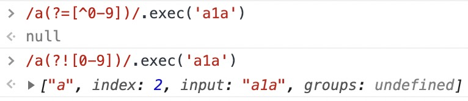

# 字符串直接量

## Syntax

```
// 字符串直接量
StringLiteral ::
  // " 双字符串字符? " -> " A? "
  " DoubleStringCharacters(opt) "
  // ' 单字符串字符? ' -> ' B? '
  ' SingleStringCharacters(opt) '
```

```
// 双字符串字符 -> A::= CA?
DoubleStringCharacters ::
  // C A?
  DoubleStringCharacter DoubleStringCharacters(opt)
```

```
// 单字符串字符 -> B::= DB?
SingleStringCharacters ::
  // D B?
  SingleStringCharacter SingleStringCharacters(opt)
```

```
// 双字符串字符 基本单位 -> C::= [^"\\E] | F | G | \H | I
DoubleStringCharacter ::
  // [^"\\E]
  SourceCharacter but not one of " or \ or LineTerminator
  // F
  <LS>
  // G
  <PS>
  // \ H
  \ EscapeSequence
  // I
  LineContinuation
```

```
// 单字符串字符 基本单位 -> D::= [^'\\E] | F | G | \H | I
SingleStringCharacter ::
  // [^'\\E]
  SourceCharacter but not one of ' or \ or LineTerminator
  <LS>
  <PS>
  \ EscapeSequence
  LineContinuation
```

```
// 连续线 -> I::= \J
LineContinuation ::
  // \ J
  \ LineTerminatorSequence
```

```
// 转义序列 -> H::= K | 0 [lookahead ∉ L] | M | N
EscapeSequence ::
  // K
  CharacterEscapeSequence
  // 0 [lookahead ∉ L]
  0 [lookahead ∉ DecimalDigit]
  // M
  HexEscapeSequence
  // N
  UnicodeEscapeSequence
```

```
// 字符转义序列 -> K::= O|P
CharacterEscapeSequence ::
  // O
  SingleEscapeCharacter
  // P
  NonEscapeCharacter
```

```
// 单一的转义字符 -> O::= ['"\\bfnrtv]
SingleEscapeCharacter :: one of
  ' " \ b f n r t v
```

```
// 非转义字符 -> P::= [^QE]
NonEscapeCharacter ::
  // [^QE]
  SourceCharacter but not one of EscapeCharacter or LineTerminator
```

```
// 转义字符 -> Q::= O|L|x|u
EscapeCharacter ::
  // O
  SingleEscapeCharacter
  // L
  DecimalDigit
  x
  u
```

```
// 十六进制转义序列 -> M::= xRR
HexEscapeSequence ::
  // x R R
  x HexDigit HexDigit
```

```
// Unicode 转义序列 -> N::= uS | u{T}
UnicodeEscapeSequence ::
  // uS
  u Hex4Digits
  // u{T}
  u{ CodePoint }
```

```
// 十六进制4位数 -> S::= RRRR
Hex4Digits ::
  // RRRR
  HexDigit HexDigit HexDigit HexDigit
```

```
// 换行符序列 -> J::= U | V[lookahead ≠ U] | F | G | VU
LineTerminatorSequence ::
  // U
  <LF>
  // V[lookahead ≠ U]
  <CR>[lookahead ≠ <LF>]
  // F
  <LS>
  // G
  <PS>
  // VU
  <CR><LF>
```

```
// 换行符 -> E::= U|V|F|G
LineTerminator ::
  <LF>
  <CR>
  <LS>
  <PS>
```

```
// 码点 -> T::= [\u0000-\u10FFFF]
CodePoint ::
  // HexDigits 不能超过 0x10FFFF
  HexDigits but only if MV of HexDigits ≤ 0x10FFFF
```

## 公式

```
StringLiteral::= "A?"|'B?'

A::= ([^"\\(\u000A|\u000D|\u2028|\u2029)]|(\u000A|\u000D|\u2028|\u2029)|\u2029|\\((['"\\bfnrtv]|[^'"\\bfnrtv0-9xu\u000A\u000D\u2028\u2029])|(0(?![0-9]))|(x[0-9a-fA-F]{2})|(u[0-9a-fA-F]{4}|[\u0000-\u10FFFF]))|\\(\u000A|\u000D(?!\u000A)|\u2028|\u2029|\u000D\u000A))+

B::= ([^'\\(\u000A|\u000D|\u2028|\u2029)]|(\u000A|\u000D|\u2028|\u2029)|\u2029|\\((['"\\bfnrtv]|[^'"\\bfnrtv0-9xu\u000A\u000D\u2028\u2029])|(0(?![0-9]))|(x[0-9a-fA-F]{2})|(u[0-9a-fA-F]{4}|[\u0000-\u10FFFF]))|\\(\u000A|\u000D(?!\u000A)|\u2028|\u2029|\u000D\u000A))+

C::= [^"\\(\u000A|\u000D|\u2028|\u2029)]|(\u000A|\u000D|\u2028|\u2029)|\u2029|\\((['"\\bfnrtv]|[^'"\\bfnrtv0-9xu\u000A\u000D\u2028\u2029])|(0(?![0-9]))|(x[0-9a-fA-F]{2})|(u[0-9a-fA-F]{4}|[\u0000-\u10FFFF]))|\\(\u000A|\u000D(?!\u000A)|\u2028|\u2029|\u000D\u000A)

D::= [^'\\(\u000A|\u000D|\u2028|\u2029)]|(\u000A|\u000D|\u2028|\u2029)|\u2029|\\((['"\\bfnrtv]|[^'"\\bfnrtv0-9xu\u000A\u000D\u2028\u2029])|(0(?![0-9]))|(x[0-9a-fA-F]{2})|(u[0-9a-fA-F]{4}|[\u0000-\u10FFFF]))|\\(\u000A|\u000D(?!\u000A)|\u2028|\u2029|\u000D\u000A)

E::= (\u000A|\u000D|\u2028|\u2029)
F::= <LS>::= \u2028
G::= <PS>::= \u2029

H::= (['"\\bfnrtv]|[^'"\\bfnrtv0-9xu\u000A\u000D\u2028\u2029])|(0(?![0-9]))|(x[0-9a-fA-F]{2})|(u[0-9a-fA-F]{4}|[\u0000-\u10FFFF])
I::= \\(\u000A|\u000D(?!\u000A)|\u2028|\u2029|\u000D\u000A)
J::= \u000A|\u000D(?!\u000A)|\u2028|\u2029|\u000D\u000A

K::= ['"\\bfnrtv]|[^'"\\bfnrtv0-9xu\u000A\u000D\u2028\u2029]

L::= [0-9]
M::= x[0-9a-fA-F]{2}

N::= u[0-9a-fA-F]{4}|[\u0000-\u10FFFF]

O::= ['"\\bfnrtv]

P::= [^'"\\bfnrtv0-9xu\u000A\u000D\u2028\u2029]

Q::= ['"\\bfnrtv]|[0-9]|x|u
R::= [0-9a-fA-F]
S::= [0-9a-fA-F]{4}

T::= [\u0000-\u10FFFF]

U::= <LF>::= \u000A
V::= <CR>::= \u000D
```

## 正则

```
StringLiteral::= "A?"|'B?'

"A?"::= "(([^"\\(\u000A|\u000D|\u2028|\u2029)]|(\u000A|\u000D|\u2028|\u2029)|\u2029|\\((['"\\bfnrtv]|[^'"\\bfnrtv0-9xu\u000A\u000D\u2028\u2029])|(0(?![0-9]))|(x[0-9a-fA-F]{2})|(u[0-9a-fA-F]{4}|[\u0000-\u10FFFF]))|\\(\u000A|\u000D(?!\u000A)|\u2028|\u2029|\u000D\u000A))+)?"

'B?'::= '(([^'\\(\u000A|\u000D|\u2028|\u2029)]|(\u000A|\u000D|\u2028|\u2029)|\u2029|\\((['"\\bfnrtv]|[^'"\\bfnrtv0-9xu\u000A\u000D\u2028\u2029])|(0(?![0-9]))|(x[0-9a-fA-F]{2})|(u[0-9a-fA-F]{4}|[\u0000-\u10FFFF]))|\\(\u000A|\u000D(?!\u000A)|\u2028|\u2029|\u000D\u000A))+)?'
```

```js
const stringReg = /^(("(([^"\\(\u000A|\u000D|\u2028|\u2029)]|(\u000A|\u000D|\u2028|\u2029)|\u2029|\\((['"\\bfnrtv]|[^'"\\bfnrtv0-9xu\u000A\u000D\u2028\u2029])|(0(?![0-9]))|(x[0-9a-fA-F]{2})|(u[0-9a-fA-F]{4}|[\u0000-\u10FFFF]))|\\(\u000A|\u000D(?!\u000A)|\u2028|\u2029|\u000D\u000A))+)?")|('(([^'\\(\u000A|\u000D|\u2028|\u2029)]|(\u000A|\u000D|\u2028|\u2029)|\u2029|\\((['"\\bfnrtv]|[^'"\\bfnrtv0-9xu\u000A\u000D\u2028\u2029])|(0(?![0-9]))|(x[0-9a-fA-F]{2})|(u[0-9a-fA-F]{4}|[\u0000-\u10FFFF]))|\\(\u000A|\u000D(?!\u000A)|\u2028|\u2029|\u000D\u000A))+)?'))$/
```

### (?=[^0-9]) vs (?![0-9])

- `(?=[^0-9])` 表示后面 `跟着的字符` 不能是 `[0-9]`，后面要有字符
- `(?![0-9])` 表示后面 `不能跟着` `[0-9]`，后面可以没有字符


