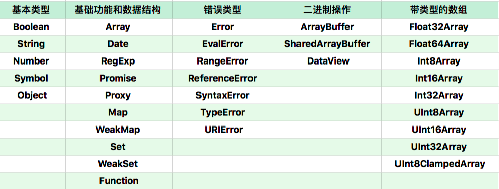

# 结构化(二)

## 从上到下

- JS Context => Realm
  - Realm1 Realm2 ... 都会创建一套
    - global
      - Infinity NaN undefined Array Objecy Date ...
- Macro
- Micro
- 函数调用(Execution Context)
- Statement
- Expression
- 直接量/变量/this

## Realm

### 对象分类

- 宿主对象 (Host Objects): JavaScript 宿主环境提供的对象
  - window
    - 一部分来自 js
    - 一部分来自 浏览器
- 内置对象 (Build-in Objects): JavaScript 语言提供
  - 固有对象 (Intrinsic Objects): 标准规定，随着 JavaScript 运行时创建而自动创建的对象实例
    - js 执行前就创建，类似基础库
  - 原生对象 (Native Objects): 用户通过 Array RegExp 等内置构造器或特殊语法创建
    
    - 可以 new 创建新的对象
    - 无法通过 class/extend 或 纯 js 代码实现
    - 这些构造器创建的对象使用了 私有字段，无法被原型继承
  - 普通对象 (Ordinary Objects): 由 {} Object 构造器 或 class 创建，能够被原型继承

#### 对象模拟函数和构造器

通过 私有字段 模拟

- 函数对象
  - [[call]]
- 构造器对象
  - [[construct]]

实现 [[call]] 和 [[construct]] 行为不一致

```js
new Date() // object
Date() // string

new Image() // object
Image() // error
```

function 或 Function 构造器创建，[[call]] 和 [[construct]] 行为相似

```js
function f() {
  return 1
}
f() // [[call]]
new f() // [[constuct]]
```

[[construct]] 执行过程

- 以 Object.prototype 创建新对象
- 以 新对象 为 this，调用 [[call]]
- [[call]] 返回对象，或 返回 新对象

### 获取全部固有对象

标准中全部对象的定义，规定了以下全局对象的属性。查找这些对象的 属性 和 Getter/Setter，就可以获得所有 固有对象

- 三个值
  - Infinity
  - NaN
  - undefined
- 九个函数
  - eval
  - isFinite
  - isNaN
  - parseFloat
  - parseInt
  - decodeURI
  - decodeURIComponent
  - encodeURI
  - encodeURIComponent
- 一些构造器
  - Array
  - Date
  - RegExp
  - Promise
  - Proxy
  - Map
  - WeakMap
  - Set
  - WeakSet
  - Function
  - Boolean
  - String
  - Number
  - Symbol
  - Object
  - Error
  - EvalError
  - RangeError
  - ReferenceError
  - SyntaxError
  - TypeError
  - URIError
  - ArrayBuffer
  - SharedArrayBuffer
  - DataView
  - Typed Array
  - Float32Array
  - Float64Array
  - Int8Array
  - Int16Array
  - Int32Array
  - UInt8Array
  - UInt16Array
  - UInt32Array
  - UInt8ClampedArray
- 四个用于当作命名空间的对象
  - Atomics
  - JSON
  - Math
  - Reflect

## 函数调用(Execution Context)

执行栈

```
  execution context2 // running execution context
  execution context1
  execution context0
execution context stack
```

- execution context
  - code evaluation state 代码执行位置
    - async await generator
  - Function
    - context 为函数
    - 全局 script 是 null
  - Script/Module
    - 同上
  - Generator
    - generator 产生的，否则是 null
  - Realm
  - LexicalEnvironment
    - 词法环境，获取变量值时用到的
  - VirableEnvironment

### LexicalEnvironment

- this
  - 2019 版本，老版在 context
- new.target
- super
- 变量

### VirableEnvironment

历史包袱，处理 var 声明

## Environment Record

链表结构

- Environment Record
  - Declarative Environment Record
    - Function Environment Record
    - Module Environment Record
  - Global Environment Record
  - Object Environment Record
    - with eval

### Function Closure

```
Function: foo
  Environment Record
    y:2
  Code
    console.log(y)
```

```js
var y = 2
function foo() {
  console.log(y)
}
foo()
```

嵌套的 Environment

```
Function: foo3
  Environment Record ---> Environment Record
    x:3                     y:2
  Code
    console.log(y,x)
```

```js
var y = 2
function foo() {
  var x = 3
  return function foo3() {
    console.log(y, x)
  }
}
foo()
```

箭头函数，附加 this

```
Function: foo3
  Environment Record ---> Environment Record
    x:3                     y:2
    this: global
  Code
    console.log(y,x)
```

```js
var y = 2
function foo() {
  var x = 3
  return () => {
    console.log(y, x)
  }
}
foo()
```

### Realm

```js
var o = new Object() // 不需要 realm，当前 realm 的 lex env 中可以获取到
var o = {} // 需要 realm，比如 别的 iframe 中的 {} 的不是当前的 Object 实例，所以需要确定在哪个 realm
Object.getPrototypeOf({}) === Object.prototype
```
